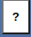
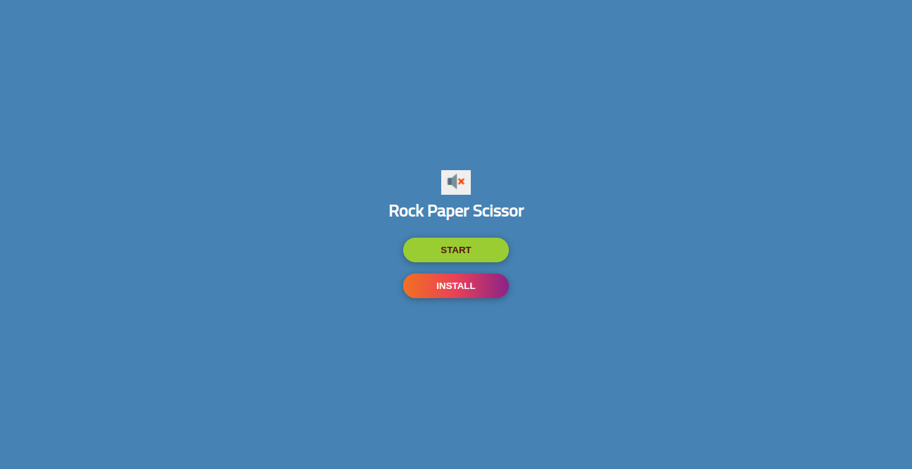
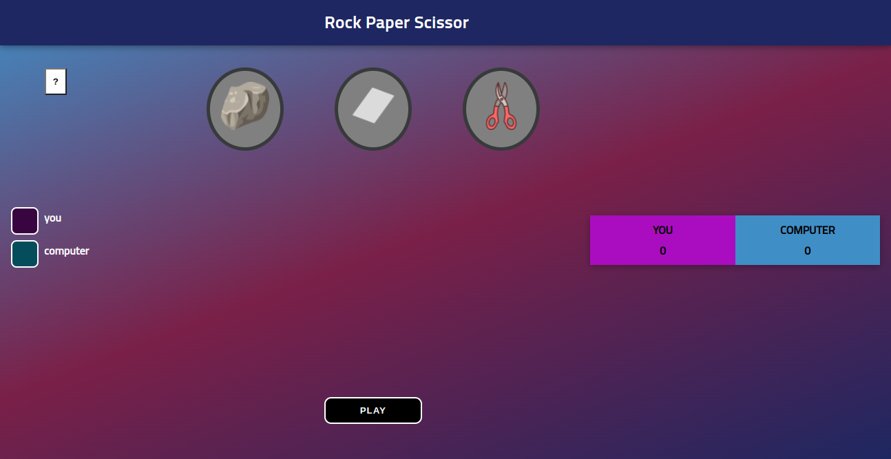

# Rock Paper Scissor
This is a funny game project. Kids have know how to play this, game also give brief description about how to play this game, just click on the "**?**" button on the left corner.  

Game included funny sounds and instant point counting table. Offcourse your opponent is ***computer*** and who reach first 10 point he/she is the winner.
feel free to play [click](https://rainbow-duckanoo-2f63e9.netlify.app)

## game
> when you open the game window open like this. Click on **play** button ( **install** button currently not working )  

> play the game have fun  

# Used technologies
1. Html 
2. Css
3. Javascript
